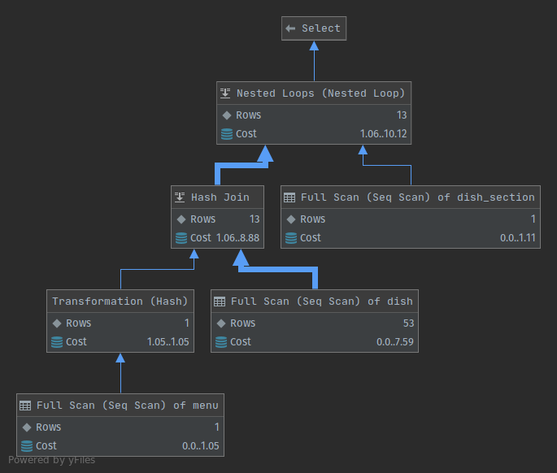
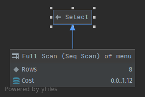
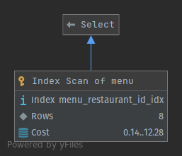

# Profiling

### Program

Main problem is very high **epoll_pwait**. This problem is not caused by number of postgers connections. 

We don't know what causes it.

### SQL

Most demanding queries in our system are like these:
```
SELECT *
  FROM Dish
  INNER JOIN Menu ON Dish.menu_id = Menu.id
  INNER JOIN Dish_section ON Dish.section_id = Dish_section.id
  WHERE Menu.restaurant_id = 717
    AND Menu.active = TRUE
    AND section_id = 287

```

We added indexes and optimized query a little.
Before:


After:


Other tables in database have too small amount of data, so query planner chooses full scan over using an index, because full scan is more effective.

```
SELECT * FROM Menu WHERE restaurant_id = 4;
```

Without index:



With index:

